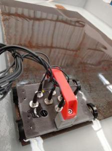

### UT 8 CHANNELS

First, install the requirements (preferably in a virtual environment):

`python3 -m venv virtual-env`

Then,

`source virtual-env/bin/activate`

Finally:

`pip install -r requirements.txt`

To read the data and export to csv, type:

`python3 ut_8channels.py <filename>`

Just replace `<filename>` with the name of the file you want to export (don't forget to add the `.utd` suffix).

The output is a xlsx file with 8 sheets (each for a sensor). In each sheet, each column represents the data of a single A-scan.
